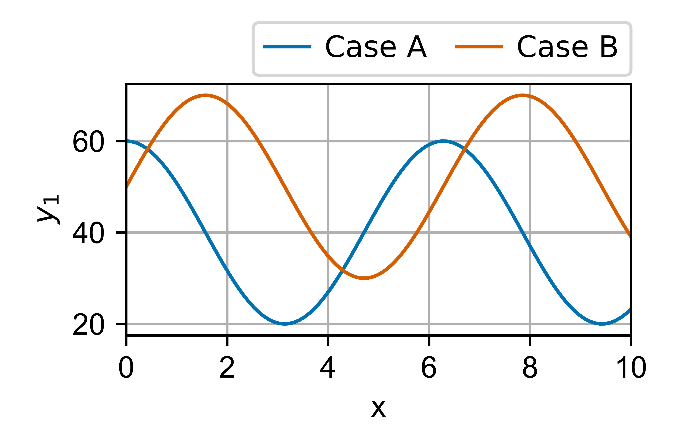
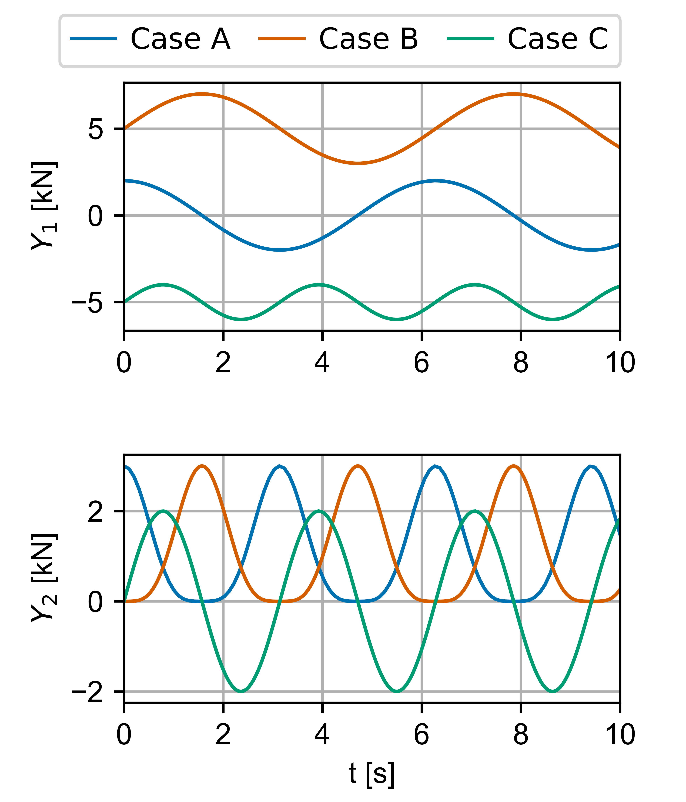

# plotops

Structured plotting utilities built on top of matplotlib.

`plotops` provides:

- Reproducible subplot layouts (cm-based sizing)
- Clean multi-source plotting
- Publication-ready figure control
- Interactive workflow tools (log toggle, pop-out, tiling)

Designed for engineering and scientific workflows where layout consistency matter.

---

## Core Modules

### `plotops.figure`

Layout and figure control:

- `layout()` – compute figure size and normalized layout parameters
- `subplot()` – tight subplot creation
- `axistight()` – MATLAB-style axis padding
- `size()` – resize/position figure window
- `tile()` – tile all open figures on screen
- `log_toggle()` – interactive log/linear toggle
- `enable_popout()` – pop active axes into new figure

---

### `plotops.plot`

High-level plotting utilities:

- `plotxy()` – multi-source row-wise plotting
- `plot3d()` – structured plotting of 3D matrices
- `corr()` – covariance → correlation matrix
- `surfiso()` – triangulated 3D surface with isolines

---

## Example 1

```python
#%% Test plot 2D
import numpy as np
import plotops

plt.close('all')

x1 = np.linspace(0, 10, 100)
x2 = np.linspace(0, 10, 400)

y1 = 20*np.cos(x1)+40
y2 = 20*np.sin(x2)+50

fig_layout=plotops.figure.layout(1,1)

fig_out = plotops.plot.plotxy(
    [x1, x2],
    [y1, y2],
    labels=['Case A','Case B'])

plotops.print.savefig(fig_out['fig'],'plot_example_1','.',figsize=fig_layout['figsize'],formats=['pdf' , 'png'])
```


## Example 2

```python
#%% Test plot 2D
import numpy as np
import plotops

x1 = np.linspace(0, 10, 100)
x2 = np.linspace(0, 10, 400)
x3 = np.linspace(0, 10, 200)

y1 = np.vstack((2*np.cos(x1),3*np.cos(x1)**4))
y2 = np.vstack((2*np.sin(x2)+5,3*np.sin(x2)**4))
y3 = np.vstack((np.sin(2*x3)-5,2*np.sin(2*x3)))

fig_layout = plotops.figure.layout(2,1)

fig_out= plotops.plot.plotxy(
    [x1, x2, x3],
    [y1, y2, y3],
    labels=['Case A','Case B','Case C'],
    xlabel='t [s]',
    ylabel=[f'$Y_{i+1}$ [kN]' for i in range(2)],
    ncols=1,
    layout_kwargs=fig_layout)

plotops.print.savefig(fig_out['fig'],'plot_example_2','.',figsize=fig_layout['figsize'],formats=['pdf' , 'png'])

```


## Example 3

```python
#%% Test plot 2D
import numpy as np
import plotops

x = np.linspace(0, 10, 100)

y1 = 20*np.random.randn(6, 100)
y2 = 20*np.random.rand(6, 100)+10

fig_layout = plotops.figure.layout(2,3)

fig_out=  plotops.plot.plotxy(
    x_list=[x],
    y_list=[y1, y2],
    ncols=3,
    suptitle='Main title',
    legend=False,
    layout_kwargs=fig_layout
)

plotops.print.savefig(fig_out['fig'],'plot_example_3','.',figsize=fig_layout['figsize'],formats=['pdf' , 'png'])
```


## Example 4

```python
#%% Test plot 2D
import numpy as np
import plotops

x=np.linspace(0,2,100)
A=np.zeros([2,3,100])

A[0,0,:]=1e1*np.exp(-x)
A[0,1,:]=1e2*np.exp(-2*x)
A[0,2,:]=1e3*np.exp(-3*x)
A[1,0,:]=1e1*np.exp(-x)
A[1,1,:]=1e1*np.exp(-2*x)
A[1,2,:]=1e1*np.exp(-3*x)

B=A+2.0

x2=np.linspace(0,2,200)

C=np.zeros([2,3,200])

C[0,0,:]=1e1*np.exp(-x2**2)
C[0,1,:]=1e2*np.exp(-x2-x2**2)
C[0,2,:]=1e3*np.exp(-x2-x2**2)
C[1,0,:]=1e1*np.exp(-x2**0.5)
C[1,1,:]=1e1*np.exp(-2*x2**0.5)
C[1,2,:]=1e1*np.exp(-3*x2**0.5)

fig_layout=plotops.figure.layout(2,3)

fig_out=plotops.plot.plot3d([x,x,x2],[A,B,C],
                    xlabel='f [Hz]',
                    linewidth=[1,2,1],
                    labels=['Data','Num','Test series'],
                    linestyle=['-','--','-'],
                    ylog=True,
                    layout_kwargs=fig_layout)

# plotops.figure.size(fig)

plotops.print.savefig(fig_out['fig'],'plot_example_4','.',figsize=fig_layout['figsize'],formats=['pdf' , 'png'])

```


